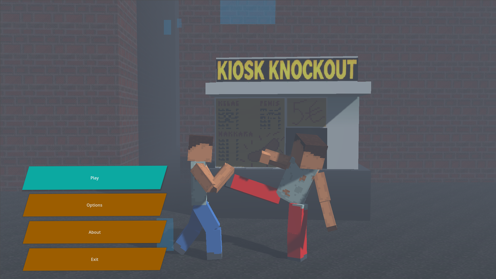
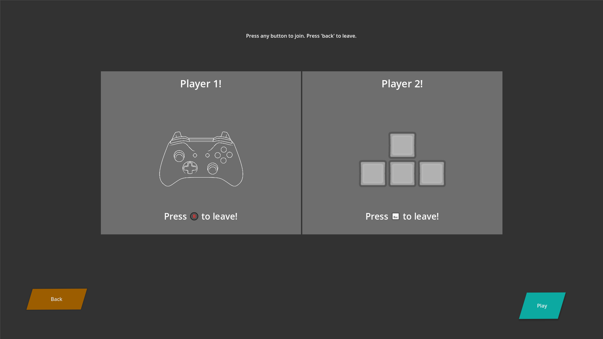
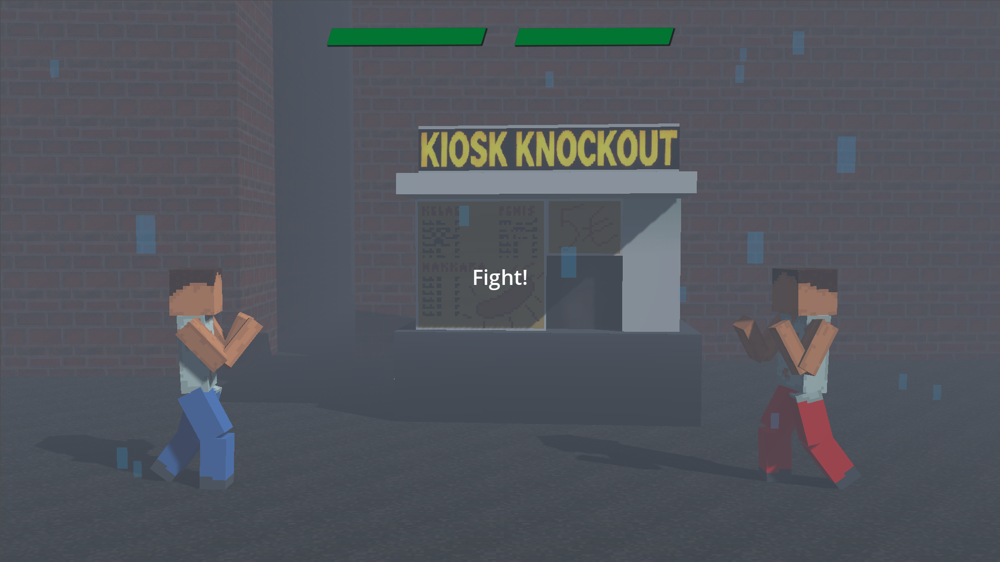
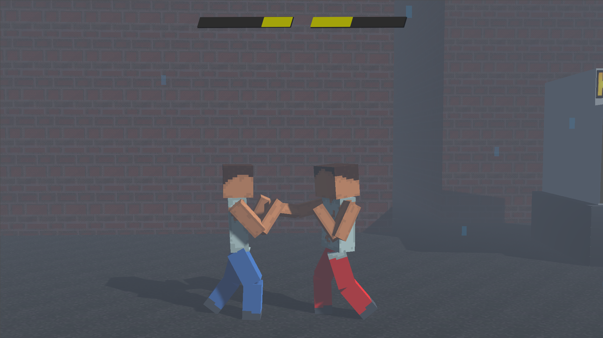

# Kiosk Knockout

**Kiosk Knockout** is a fighting game made with the [GodotEngine](https://godotengine.org), it was made for a course at [Turku University of Applied Sciences](https://www.turkuamk.fi/en/).

The game is playable at https://g2ffi.itch.io/kioskknockout.

[Images](#images)

## Installation

1. Head to https://github.com/miklaskarjalainen/KioskKnockout/releases and select the latest version.
2. Download the right executable for your operating system.
3. Run the executable.

## Building from source

**Prerequisites**

1. Install [Git](https://git-scm.com/downloads).
2. Install [Godot 4.3](https://godotengine.org/download/archive/4.3-stable/).
3. Add Godot to your `PATH`.

### Windows

1. Clone the repository `git clone https://github.com/miklaskarjalainen/KioskKnockout`.
2. Navigate to the directory `cd ./KioskKnockout`.
3. Run the build script `./export-windows.bat`.

### Linux

1. Clone the repository `git clone https://github.com/miklaskarjalainen/KioskKnockout`.
2. Navigate to the directory `cd ./KioskKnockout`.
3. Run the build script `./export-linux_x86_64.bat`.

### Web

1. Clone the repository `git clone https://github.com/miklaskarjalainen/KioskKnockout`.
2. Navigate to the directory `cd ./KioskKnockout`.
3. Run the build script `./export-web.bat`.

## Images

